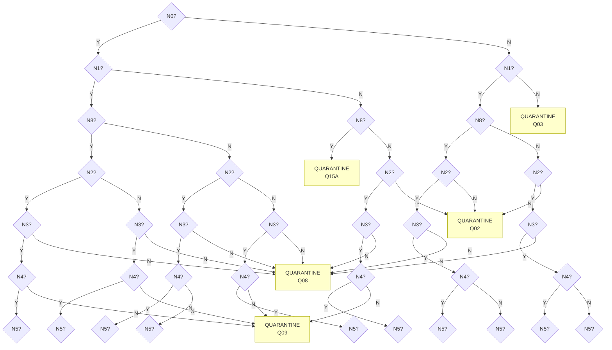

# Decision Tree Visual (Mermaid) — v1.0 (P134)

> Truncated to the **forced-tier** (N0→N1→N8→N2→N3→N4→N5) for readability.  Full
> internal tree has 126 nodes; this BFS-truncated view shows the first 35
> internal nodes + 5 synthetic forced-fail leaves reached within depth ≤6.
> See `config/operational_decision_tree.yaml` for the full structure.

## Color legend

- AUTO leaves: green
- REPAIR leaves: blue
- QUARANTINE leaves: yellow
- INVALID leaves: red

(Full leaves with AUTO/REPAIR/non-synthetic QUARANTINE/INVALID classes are
beyond depth 6 from root and not rendered in this truncated view.)

---
